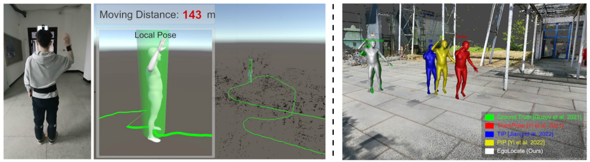

# EgoLocate

Code for our SIGGRAPH 2023 [paper](https://arxiv.org/abs/2305.01599) "EgoLocate: Real-time Motion Capture, Localization, and Mapping with Sparse Body-mounted Sensors". See [Project Page](https://xinyu-yi.github.io/EgoLocate/).



EgoLocate estimates accurate human pose, localization, and reconstructs the scene in sparse 3D points **from 6 IMUs and a head-mounted camera**. Importantly, EgoLocate **does not rely on pre-scanning the scene**, and runs in **real time on CPU**.        

## Usage

### Build the SLAM library

The SLAM library is implemented in C++ based on [ORB-SLAM3](https://github.com/UZ-SLAMLab/ORB_SLAM3). Please follow the [instructions](slam/README.md) in the `slam/` folder to build the library. 

### Prepare mocap dependencies

The mocap module is implemented in Python based on our previous works [PIP](https://xinyu-yi.github.io/PIP/) and [TransPose](https://xinyu-yi.github.io/TransPose/).  Please follow the [instructions](mocap/README.md) in the `mocap/` folder to prepare the dependencies. 

### Run the live example

We provide a minimal 30-second live example for the users to examine whether the system is configured correctly. We suggest compiling the slam library with `use_viewer=true`. Then, run:

```bash
python test_live_recording.py
```

The system will first perform the curve initialization. When the initialization is finished, calibration matrices `SMC0` and `RHC` will be printed (need `VerboseLevel=4` in `3.yaml`, the default setting). After a period of walking, when the subject go back to the starting position, the system will perform a loop closure optimization.

### Prepare test datasets

- **[TotalCapture](https://cvssp.org/data/totalcapture/) dataset**

  To evaluate our method on TotalCapture dataset, we synthesized monocular videos using a virtual first-person camera in 3 virtual scenes of different sizes. Please first contact the [TotalCapture authors](https://cvssp.org/data/totalcapture/#License) to get the permission to the dataset. Then, download the synthesized videos, data, and further instructions [here](). *(coming soon...)*

- **[HPS](https://virtualhumans.mpi-inf.mpg.de/hps/download_and_license.html) dataset**

  *We are still collecting scripts used for HPS dataset...*

### Translation evaluation

- To run the method for one sequence in the TotalCapture dataset, execute:

  ```bash
  python test_totalcapture.py --run <seq_idx> <n>
  ```

  This will test the `<seq_idx>`th sequence (0~44) and save the result as `seq_<seq_idx>_<n>.pt`. It includes the estimated pose and translation. If you want to visually compare the estimated motion with TransPose/PIP in real time during running, add `--visualize` (black=ground truth; green=ours; white=PIP).  

  *Note: you may also set `use_viewer=true` when configuring the SLAM library to have a full visualization. For more debug information, modify `VerboseLevel` in the yaml configuration file. TotalCapture use `0.yaml`.*

- To run the method on the whole TotalCapture dataset for a full test, run:

  ```bash
  ./test.sh
  ```

  This will run all 45 sequences 9 times and will take about 9 hours. 

- After running the method on the whole dataset, get the translation error by:

  ```bash
  python test_totalcapture.py --evaluate <motion_type>
  ```

  This will read the saved results and compute the absolute translation errors and standard deviations. You can use any one of `acting, freestyle, rom, walking, all` for the `<motion_type>`. This will evaluate the specific type of motions for TotalCapture dataset.

## Performance

Testing on a laptop with Intel(R) Core(TM) i7-12700H CPU, our method runs at ~70fps. The method runs **purely on CPU** in real time.

Note that if you have a high-performance CPU and the method runs much faster than 60fps, you may need to set `use_clock = True` in Line 11 in `egolocate.py`. This will force the mocap to run at 60fps, giving enough time for the back-end mapping.

## Notes

***Authors: Due to the size of this project, the instructions provided may not be comprehensive. Should you encounter any difficulties or notice any important bugs, please leave an issue and the author will promptly update the code.*** 

## Citation

If you find the project helpful, please consider citing us:

```
TBD
```

